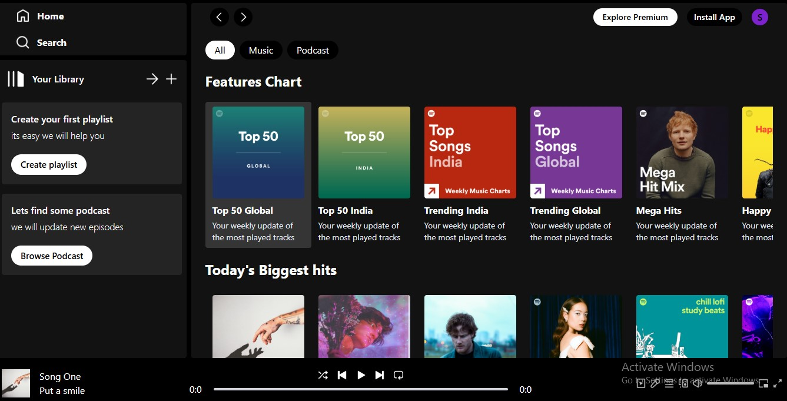
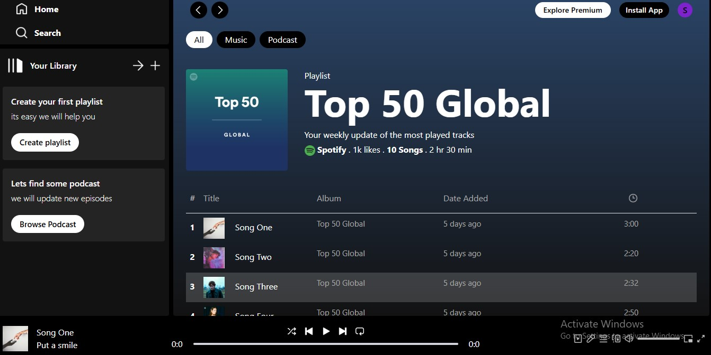

# Spotify Clone - Frontend

This is a frontend project of a Spotify clone built using **React** and **Tailwind CSS**. The project aims to replicate the core functionality and design of Spotify's user interface. It includes features such as playlists, track management, and user controls.

## Features

- User interface similar to Spotify's layout
- Playlists and tracks display
- Smooth navigation with React Router
- Responsive design with Tailwind CSS
- Interactive elements like play/pause buttons, volume control, and track selection

## Technologies Used

- **React**: A JavaScript library for building user interfaces
- **Tailwind CSS**: A utility-first CSS framework for styling
- **React Router**: For handling routing between pages

## Home Page



## Album Page




## Other Files (currently working on it)

- **Spotify_Backend**: https://github.com/sivasanjeevs/Spotify_Clone_Backend
- **Spotify_Admin**: https://github.com/sivasanjeevs/Spotify_Clone_Admin
  

**Clone the repository**:

   ```bash
   git clone https://github.com/sivasanjeevs/Spotify_Clone_Frontend.git
   cd Spotify_Clone_Frontend
